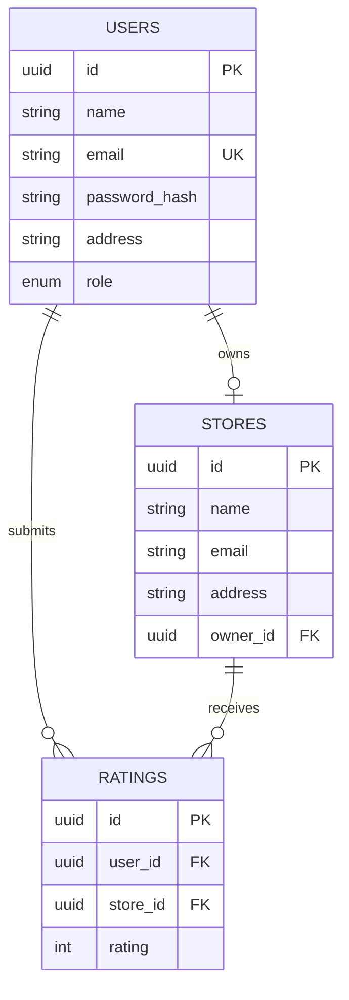

# Store Rating Web Application

Full-stack app for rating stores (1–5) across three roles — System Administrator, Normal User, Store Owner — behind one shared login. Built for the FullStack Intern Coding Challenge.

## Tech stack

- **Backend:** Express.js + TypeScript, Prisma ORM, PostgreSQL, JWT auth, Zod validation
- **Frontend:** React + TypeScript (Vite), Tailwind CSS v4, React Router, React Hook Form + Zod
- **Infra:** Docker Compose (Postgres), npm workspaces monorepo

## Repository structure
```
store-rating-app/
├── backend/ Express API (routes → controllers → services → Prisma)
├── frontend/ React SPA
└── docker-compose.yml
```

## Setup

1. **Clone and install**
```bash
   git clone <repo-url>
   cd store-rating-app
   npm install --legacy-peer-deps
```

2. **Start Postgres**
```bash
   docker compose up -d
```

3. **Backend env**
```bash
   cd backend
   cp .env.example .env   # fill in JWT_SECRET
   npx prisma migrate dev
   npx prisma generate
   npm run db:seed
   npm run dev             # http://localhost:5000
```

4. **Frontend env** (new terminal)
```bash
   cd frontend
   cp .env.example .env
   npm run dev             # http://localhost:5173
```

## Environment variables

**`backend/.env`**
| Variable | Description |
|---|---|
| `PORT` | Backend port (default 5000) |
| `DATABASE_URL` | Postgres connection string |
| `JWT_SECRET` | Secret used to sign JWTs |
| `JWT_EXPIRES_IN` | Token lifetime (e.g. `7d`) |

**`frontend/.env`**
| Variable | Description |
|---|---|
| `VITE_API_BASE_URL` | Backend API base URL (e.g. `http://localhost:5000/api`) |

## Database schema


`ratings` has a `UNIQUE(user_id, store_id)` constraint — resubmitting becomes an update, not a duplicate.

## API endpoints

| Method | Path | Role | Description |
|---|---|---|---|
| POST | `/api/auth/register` | Public | Register as a normal user |
| POST | `/api/auth/login` | Public | Log in, returns JWT |
| PUT | `/api/auth/password` | Any authenticated | Change own password |
| GET | `/api/admin/dashboard` | Admin | User/store/rating counts |
| POST | `/api/admin/users` | Admin | Create user (any role) |
| POST | `/api/admin/stores` | Admin | Create store for a store owner |
| GET | `/api/admin/users` | Admin | List + filter + sort users |
| GET | `/api/admin/stores` | Admin | List + filter + sort stores |
| GET | `/api/admin/users/:id` | Admin | User detail (+ rating if store owner) |
| GET | `/api/stores` | Normal user | Search stores, overall + own rating |
| POST | `/api/stores/:id/ratings` | Normal user | Submit a rating |
| PUT | `/api/stores/:id/ratings` | Normal user | Modify a rating |
| GET | `/api/store-owner/dashboard` | Store owner | Raters list + average rating |

## Git workflow

`main` stays submission-ready, `dev` is the integration branch, every task ran on its own `feature/*` branch merged into `dev`. Commits follow Conventional Commits (`feat:`, `fix:`, `chore:`, `docs:`).

## How to use the web application

### Everyone
- Go to `/login` to sign in, or `/signup` to register a new **normal user** account (name, email, address, password).
- Password rules: 8–16 characters, at least one uppercase letter and one special character.
- Once logged in, you're redirected automatically based on your role.

### System Administrator
1. Log in — lands on **Dashboard**, showing total users, total stores, and total ratings.
2. Go to **Users** to see every account. Use the filter fields (name/email/address/role) and click a column header to sort ascending/descending.
3. Click **View** on any row to see full details — store owners additionally show their store's average rating.
4. Click **Add user** to create a new user with any role (Normal User, Admin, or Store Owner).
5. Go to **Stores** to see every store with its computed average rating, filterable and sortable the same way.
6. Click **Add store** to register a store — requires the ID of an existing user with the **Store Owner** role as the owner (copy their ID from the Users view first).
7. **Log out** from the top-right corner.

### Normal User
1. After signing up (or logging in), you land on **Stores** — every registered store with its address and overall (average) rating.
2. Use the search boxes to filter by name or address, and click a column header to sort.
3. Click stars in the **Your rating** column to submit a rating (1–5). Click different stars later to change it — this updates your existing rating rather than creating a new one.
4. Go to **Change password** in the nav to update your password (requires your current password).

### Store Owner
*(Store Owner accounts are created by an Administrator — there's no public signup for this role.)*
1. Log in — lands on your **Dashboard**, showing your store's average rating and total number of ratings.
2. The table below lists everyone who has rated your store, with their name, email, rating, and date — sortable by any column.
3. Go to **Change password** in the nav to update your password.

## Seeded demo accounts

Run `npm run db:seed` (from `backend/`) to create:

| Role | Email | Password |
|---|---|---|
| Admin | admin@storerating.com | Admin@1234 |
| Store Owner | owner1@test.com | Passw0rd! |
| Store Owner | owner2@test.com | Passw0rd! |
| Normal User | soham@test.com | Passw0rd! |
| Normal User | priya@test.com | Passw0rd! |
| Normal User | rahul@test.com | Passw0rd! |

The seed also creates 2 stores and 5 sample ratings between them. It's idempotent — safe to re-run; it skips any account that already exists.

## Known limitations

- The `ratings.rating BETWEEN 1 AND 5` check is enforced by Zod validation on both ends; Prisma's schema language has no native `CHECK` syntax, so the equivalent DB-level constraint needs to be added manually to the generated migration SQL if stricter DB-level enforcement is required.
- CORS is currently open (`cors()` with no origin allowlist) for local development — restrict this before any real deployment.
- Assigning a store to an owner in the admin UI requires manually copying the owner's user ID; a searchable owner picker would be a natural next improvement.